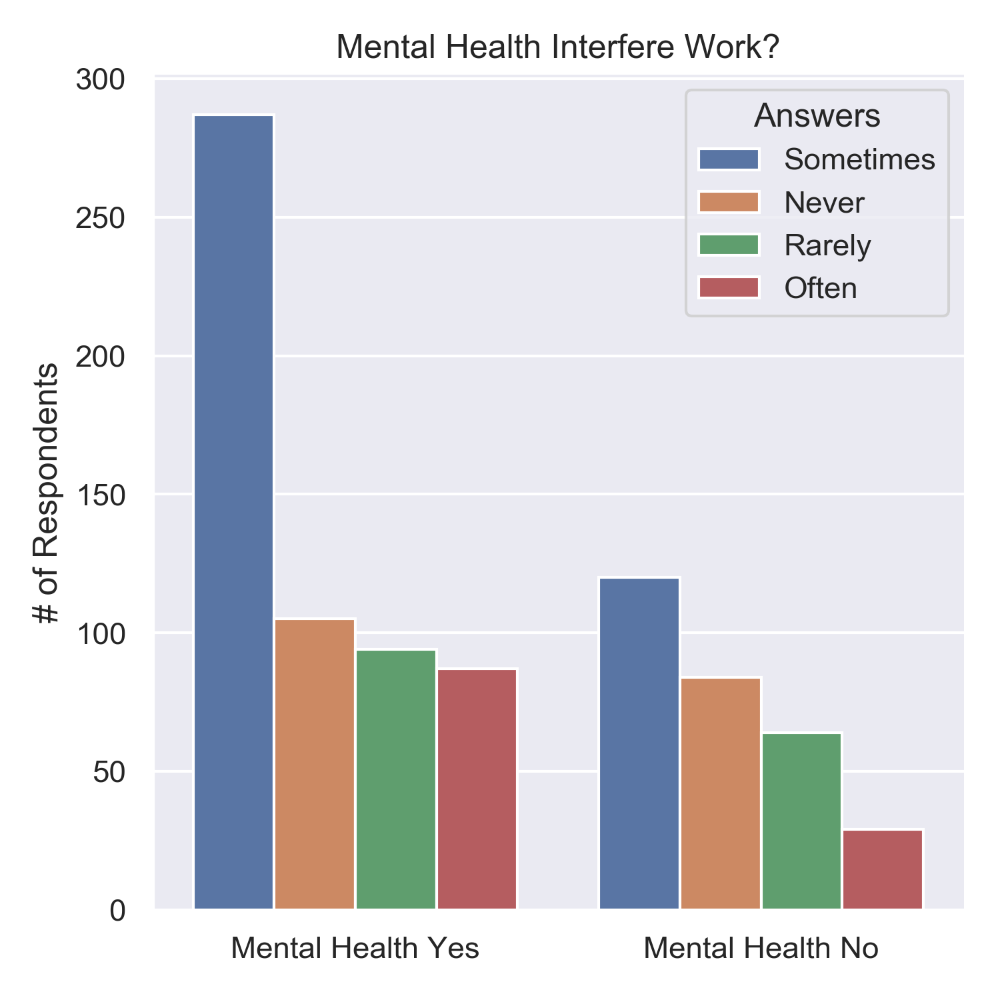
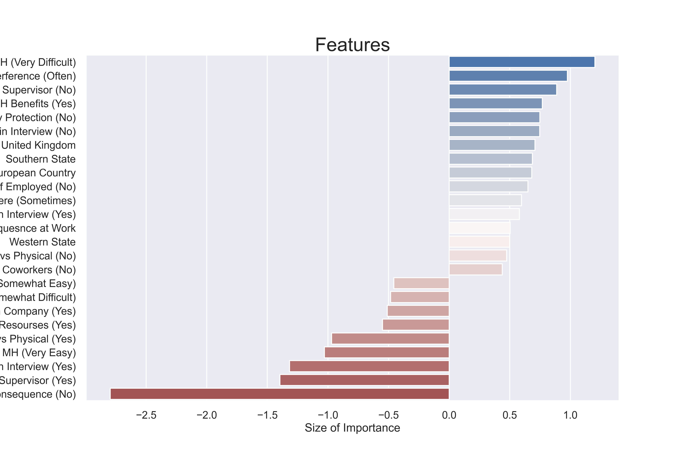

# Mental Health in the Tech Industry

**Authors**: Ignacio Ruiz, Justin Williams

## Overview

Open Sourcing Mental Illness (OSMI) is a non-profit, 501(c)(3) corporation dedicated to raising awareness and educating others about mental illness. They provide resources to support mental wellness in the tech and open source communitees. A dataset from a OSMI survey conducted primariliy in 2014, was procured via kaggle and utilized for our analysis. 

Our research question was:

_"What factors can influence tech industry employees to withhold discussing mental health illness with their employer"_

Essentially, we wanted to know what variables would lead to folks answering _Yes_ or _No_ to our target variable:

_"Do you believe discussing mental health illness with your employer could have negative consequences?"_

We utilized binary classification to train several machine learning models on the dataset. Our main takeaways were respondents knowledge of _benefits_ package, comfortability with _supervisor_ and _interference_ of mental illness with work, were the primary indicators of an answer of _Yes_ to the target variable. Our reccomendations are:

- Having open discussions at the beginning of the hiring process, could improve the comfortability of employees discussions on mental health in the future. 

- Holding benefit fairs regularly to explain options for employees to handle their mental health.
 
- Create options for group activities to strengthen comradery in the workplac


## Business Problem

With tech jobs exponentially increasing, mental health within the tech industry continious to be a salient topic. According to [OSMI](https://osmihelp.org/about/about-osmi), the environment and the way we talk about mental illness in general, needs to change. This was our rationale behind choosing _"Do you believe discussing mental health illness with your employer could have negative consequences_" as our target variable. We hypothesized that if an employee felt discussing a mental health issue with their employer could lead to negative consequences, this would indicate a poor environment for those suffering to recover. Therefore, tech employers looking to improve their workplace environments for those with mental health illness, could take the reccomendations provided from this analysis to make long term sustainable changes.

## Data

The dataset utilized was from a 2014-2016 tech industry mental illness survey by non-profit OSMI procured through kaggle. The survey consisted of a series of questions with multiple choice answers that varied depedning upon the question asked. For instance:

_"If you have a mental health condition, do you feel that it interferes with your work?"_

The answers were:
- Sometimes
- Never
- Rarely
- Often

As a result, besides an age, and timestamp column, the data was all categorical. Our target itself actually had three answers:

_"Do you believe discussing mental health illness with your employer could have negative consequences?"_
- Yes
- No
- Maybe

We ended up combining _Yes/Mabye_, to make it a strict binary classification. We did this because we felt if respondents were unsure (answered maybe) to the question, then it was evident there was somem degree of uncomfortabiliy in broaching the subject of mental illness with their employer. 

Besides basic demographical questions of `Age`, `Sex`, `Country` and `State`, here is a list of all the questions asked in the survey and subsequently utilized in this analysis:

| #  | Question                                                                                                               |
|----|------------------------------------------------------------------------------------------------------------------------|
| 1  | If you live in the United States, which state or territory do you live   in?                                           |
| 2  | Are you self-employed?                                                                                                 |
| 3  | Do you have a family history of mental illness?                                                                        |
| 4  | Have you sought treatment for a mental health condition?                                                               |
| 5  | If you have a mental health condition, do you feel that it interferes   with your work?                                |
| 6  | How many employees does your company or organization have?                                                             |
| 7  | Do you work remotely (outside of an office) at least 50% of the time?                                                  |
| 8  | Is your employer primarily a tech company/organization?                                                                |
| 9  | Does your employer provide mental health benefits?                                                                     |
| 10 | Do you know the options for mental health care your employer provides?                                                 |
| 11 | Has your employer ever discussed mental health as part of an employee   wellness program?                              |
| 12 | Does your employer provide resources to learn more about mental health   issues and how to seek help?                  |
| 13 | Is your anonymity protected if you choose to take advantage of mental   health or substance abuse treatment resources? |
| 14 | How easy is it for you to take medical leave for a mental health   condition?                                          |
| 15 | Do you think that discussing a mental health issue with your employer   would have negative consequences?              |
| 16 | Do you think that discussing a physical health issue with your employer   would have negative consequences?            |
| 17 | Would you be willing to discuss a mental health issue with your   coworkers?                                           |
| 18 | Would you be willing to discuss a mental health issue with your direct   supervisor(s)?                                |
| 19 | Would you bring up a mental health issue with a potential employer in an   interview?                                  |
| 20 | Would you bring up a physical health issue with a potential employer in   an interview?                                |
| 21 | Do you feel that your employer takes mental health as seriously as   physical health?                                  |
| 22 | Have you heard of or observed negative consequences for coworkers with   mental health conditions in your workplace?   |
| 23 | Any additional notes or comments                                                                                       |
***
Questions to consider:
* Where did the data come from, and how do they relate to the data analysis questions?
* What do the data represent? Who is in the sample and what variables are included?
* What is the target variable?
* What are the properties of the variables you intend to use?
***

## Methods

The intial analysis process consisted of basic data cleaning. This included identifying erroneous enteries in the `Age` column, and imputing `Sex`_ to ternary _Male_, _Female_ and _Gender Variant_. After this we converted the target variable to binary and began to compare it against various features within the dataset. Exploratory data analysis (EDA) allowed us to view view age and gender distributions and their respective answers to the target. We then began to create smaller data frames that would allow us to create charts comparing respondents answers to specific questions, and their resulting answer to the target variable. After this we engineered some geographical features dividing the countries up into continent like groups, and the US states into regional type sub-divisions. This allowed us to see patterns in how someone would answer the target variable based on where they were geographically located. 

After engineering some features, we ran Logistic Regression and Decision Tree Classifier (DTC) models. We found the Logistic Regression model performed significantly better then the DTC. We subsequently did some feature selection with a Recursive Feature Elimiation Cross Validation (RFECV) and whittled our coefficients down to only the most influential. We subsequently computed frequency tables for each coefficient to gather the log odds of each question. After this  we isolated the top 5 positive and top 5 negative coefficients which informed our reccomendations. 

## Results

Our most sucessful model was a Logistic Regression model, which after RFECV was whittled down from over 90 to 25 features. This gave us an F1 score of ~.89. The DTC model even after RFECV gave us an F1 score of ~.84. Therefore, we decided to proceed with a Logistic Regression model. In analyzing the top coefficients, we found the following:

**Leave**
- If respondents perceived that is was _very difficult_ to take a leave of absence from their job, they answered _Yes_ to the target 94% of the time. 

**Physical Health**
- If respondents felt discussing a physical health issue with their employer would _maybe_ lead to negative consequences, they answered _Yes_ to the target 97% of the time.  

**Supervisor**
- If respondents did _not_ feel comfortable discussing a mental health illness with their direct supervisor, they answered _Yes_ to the target 92% of the time

**Work interfere**
- If respondents had a mental health illness and felt  it interfered with their work_often_, they answered _Yes_ to the target 74% of the time 

### Binary Target Percent


- Binary target around 60% yes and 37% no

### Gender, Age and Target


- The age and gender of respondents did not have a large relationship with the target. There is a slight increase of older respondents answering yes to the target then no. 

### Mental Health Interfere Work


- Those that suffered from mental illness and answered that is _sometimes_ interfered with their work, overwhelmingly answered yes to the target. 

### Final Coefficients


- A list of features and their respective coefficients.

## Conclusions

Simply, providing benefits is not enough for an employees to feel comfortable speaking about their mental health. Health benefits, in particular leave and mental illness health benefits, need to be championed in order to create an optimal environment for open discusions. Work relationship with direct supervisor is paramount to creating a safe space for discussion and physical health is a more comfortable topic of discussion for employees than mental health. 

As a result our recommendations for next steps are:

- Having open discussions at the beginning of the hiring process, could improve the future comfortability of employees discussions on mental illness. 

- Holding benefit fairs regularly to explain options for employees to handle their mental health could improve visability of benefit options for mental illness.
 
- Creating options for group activities to strengthen comradery in the workplace could improve relationships between employees and direct supervisors. 

## For More Information

Please review our full analysis in [our Jupyter Notebook](./Master_Mentalhealth.ipynb) or our [presentation](./Mental_Health_in_the_Tech_Industry.pdf).

For any additional questions, please contact **Ignacio Ruiz cruizbran@gmail.com, Justin Williams justinmorganwilliams@gmail.com**

## Repository Structure

```
├── README.md                           <- The top-level README for reviewers of this project
├── Master_Mentalhealth.ipynb   <- Narrative documentation of analysis in Jupyter notebook
├── Mental_Health_in_the_Tech_Industry.pdf         <- PDF version of project presentation
├── data                                <- Both sourced externally and generated from code
└── images                              <- Both sourced externally and generated from code
```
